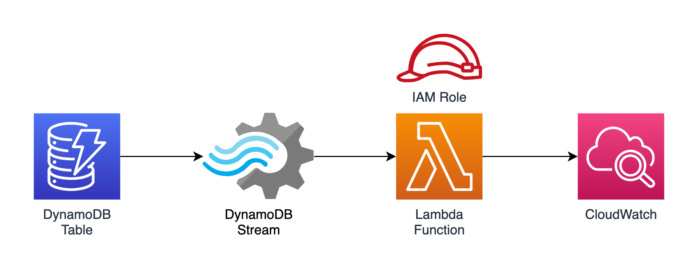

# Terraform AWS DynamoDB Stream Lambda Architecture Pattern

Terraform implementation of a commonly-used AWS architecture pattern of processing a DynamoDB stream using a Lambda function.

The DynamoDB table:

- Expects its name to be provided as a Terraform variable.
- Is created with a partition key named "ID" of type string.
- Has its billing mode set to on-demand.
- Has no global or local secondary indexes.
- Has server-side encryption enabled using DynamoDB-managed keys.
- When an item in the table is modified, both the old and the new versions of the modified item are written to the stream.

The Lambda function:

- Uses Node.js 14.
- Can only access CloudWatch and DynamoDB streams.
- Currently only logs the event it is invoked with. Replace its code with your own.
